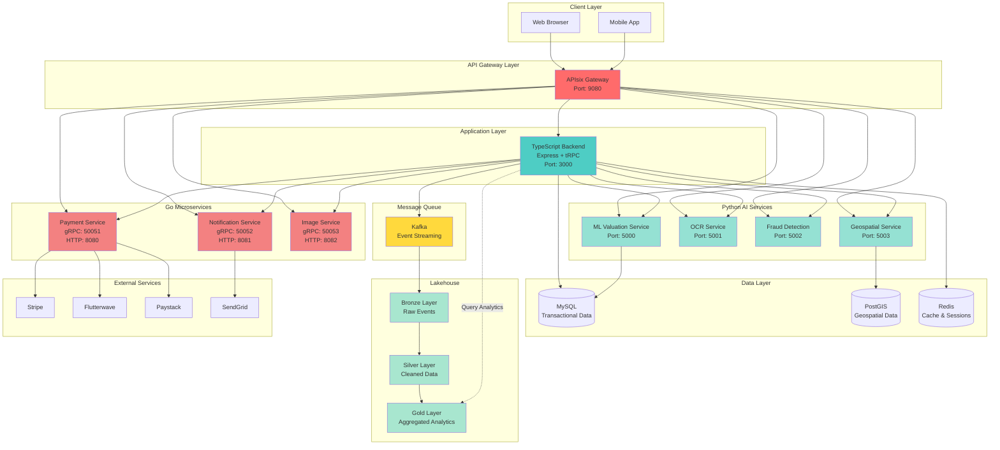
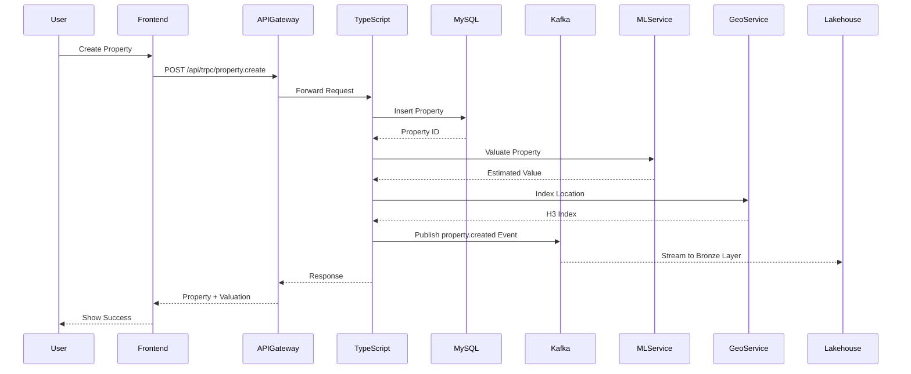
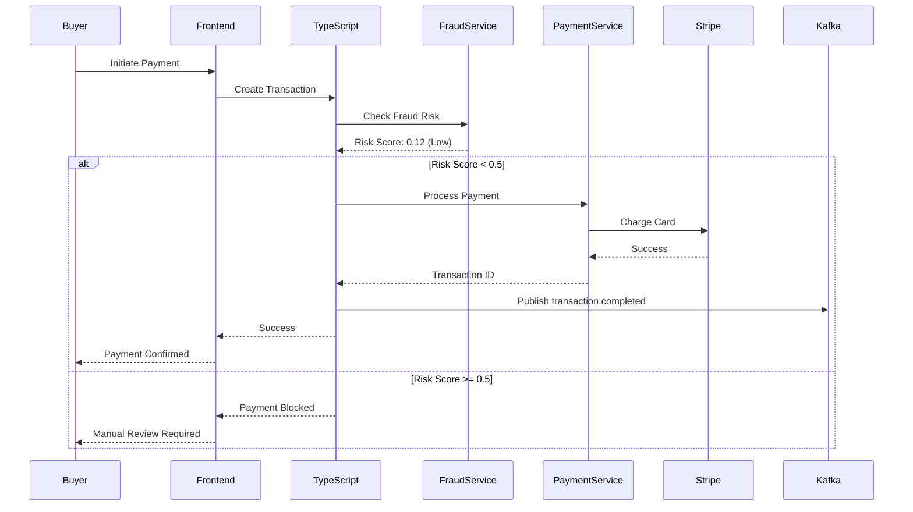
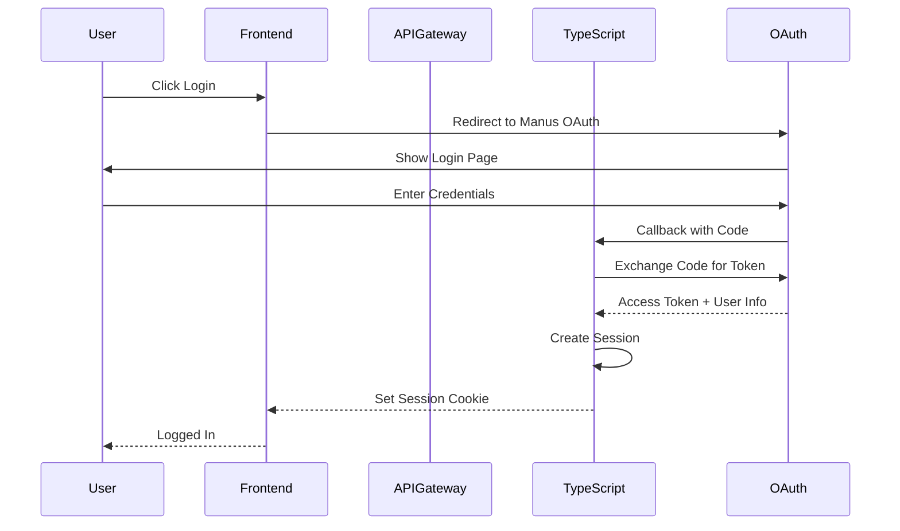

# System Architecture

Complete architecture documentation for the Next-Generation Real Estate Platform.

---

## Table of Contents

1. [System Overview](#system-overview)
2. [Architecture Diagram](#architecture-diagram)
3. [Service Layer Architecture](#service-layer-architecture)
4. [Data Flow](#data-flow)
5. [Event-Driven Architecture](#event-driven-architecture)
6. [Deployment Topology](#deployment-topology)

---

## System Overview

The platform is built as a **microservices architecture** with the following key characteristics:

- **Frontend**: React 19 + TypeScript + Tailwind CSS
- **Backend**: Node.js + Express + tRPC
- **Microservices**: Go (performance-critical) + Python (AI/ML)
- **Data Layer**: MySQL (transactional) + PostGIS (geospatial) + Redis (cache)
- **Event Streaming**: Kafka → Lakehouse (Bronze/Silver/Gold)
- **API Gateway**: APIsix (routing, rate limiting, auth)

---

## Architecture Diagram



---

## Service Layer Architecture

### Layer 1: API Gateway (APIsix)

**Responsibilities:**
- Unified entry point for all traffic
- Route requests to appropriate services
- Rate limiting (100 req/min per route, 1000 req/min global)
- CORS handling
- Request ID tracking
- Prometheus metrics export

**Configuration:**
```yaml
Routes:
  - /api/* → TypeScript Backend
  - /ml/* → ML Valuation Service
  - /ocr/* → OCR Service
  - /fraud/* → Fraud Detection Service
  - /geo/* → Geospatial Service
  - /payment/* → Payment Service
  - /notification/* → Notification Service
  - /image/* → Image Service
```

### Layer 2: TypeScript Backend

**Responsibilities:**
- Main application logic
- tRPC API endpoints
- OAuth authentication
- Database operations (MySQL)
- Service orchestration
- Event publishing (Kafka)

**Key Modules:**
- `server/routers.ts` - tRPC procedure definitions
- `server/db.ts` - Database query helpers
- `server/_core/serviceClients.ts` - Microservice clients
- `server/_core/kafkaPublisher.ts` - Event publishing
- `server/_core/lakehouseClient.ts` - Analytics queries

### Layer 3: Python AI Services

#### ML Valuation Service
**Technology:** Python + FastAPI + Scikit-learn + XGBoost  
**Purpose:** Property price prediction using machine learning

**Endpoints:**
- `POST /valuate` - Single property valuation
- `POST /batch-valuate` - Batch valuation
- `GET /market-trends/{region}` - Market trend analysis

**ML Models:**
- XGBoost Regressor (primary)
- Random Forest (ensemble)
- Neural Network (deep learning)

#### OCR Service
**Technology:** Python + FastAPI + Tesseract + OpenCV  
**Purpose:** Document OCR and face verification

**Endpoints:**
- `POST /process` - Extract text from documents
- `POST /verify-face` - Face matching verification

**Capabilities:**
- ID card extraction
- Passport scanning
- Face detection & matching
- Confidence scoring

#### Fraud Detection Service
**Technology:** Python + FastAPI + Scikit-learn  
**Purpose:** Transaction fraud risk scoring

**Endpoints:**
- `POST /check` - Fraud risk assessment
- `GET /profile/{userId}` - User risk profile

**Risk Factors:**
- Transaction patterns
- Device fingerprinting
- Location anomalies
- Behavioral analysis

#### Geospatial Service
**Technology:** Python + FastAPI + PostGIS + H3  
**Purpose:** Spatial queries and geospatial analytics

**Endpoints:**
- `POST /search/nearby` - Radius search
- `POST /search/polygon` - Polygon containment
- `GET /heatmap` - Price heatmap generation
- `GET /neighborhood/{h3Index}` - Neighborhood stats

**Features:**
- H3 hexagonal indexing
- Spatial joins
- Isochrone generation
- POI search

### Layer 4: Go Microservices

#### Payment Service
**Technology:** Go + gRPC + HTTP  
**Purpose:** Multi-provider payment processing

**Providers:**
- Stripe (cards, ACH)
- Flutterwave (African markets)
- Paystack (Nigerian market)

**Features:**
- Unified payment interface
- Webhook handling
- Refund processing
- Transaction history

#### Notification Service
**Technology:** Go + gRPC + HTTP  
**Purpose:** Multi-channel notifications

**Channels:**
- Email (SendGrid)
- SMS (Twilio)
- Push notifications
- In-app notifications

**Features:**
- Template management
- Delivery tracking
- Retry logic
- Rate limiting

#### Image Service
**Technology:** Go + gRPC + HTTP  
**Purpose:** Image processing and optimization

**Features:**
- Upload to S3
- Resize & crop
- Format conversion
- Thumbnail generation
- Watermarking

---

## Data Flow

### Property Creation Flow



### Transaction Processing Flow



---

## Event-Driven Architecture

### Kafka Topics

| Topic | Producer | Consumer | Schema |
|-------|----------|----------|--------|
| `property.created` | TypeScript | Lakehouse | PropertyCreatedEvent |
| `property.updated` | TypeScript | Lakehouse | PropertyUpdatedEvent |
| `user.registered` | TypeScript | Lakehouse | UserRegisteredEvent |
| `transaction.completed` | TypeScript | Lakehouse, Analytics | TransactionCompletedEvent |
| `valuation.requested` | TypeScript | ML Service | ValuationRequestedEvent |

### Event Schemas

#### PropertyCreatedEvent
```typescript
{
  eventId: string;
  eventType: 'property.created';
  timestamp: string; // ISO 8601
  version: '1.0';
  data: {
    propertyId: string;
    userId: string;
    title: string;
    description: string;
    price: number;
    location: {
      address: string;
      city: string;
      state: string;
      zipCode: string;
      lat: number;
      lng: number;
    };
    features: {
      bedrooms: number;
      bathrooms: number;
      sqft: number;
      propertyType: string;
      yearBuilt?: number;
    };
  };
}
```

### Lakehouse Data Pipeline

```mermaid
graph LR
    KAFKA[Kafka Topics] --> FLINK[Apache Flink<br/>Stream Processing]
    FLINK --> BRONZE[Bronze Layer<br/>Raw JSON Events]
    
    BRONZE --> SPARK1[Spark Job<br/>Data Cleaning]
    SPARK1 --> SILVER[Silver Layer<br/>Normalized Tables]
    
    SILVER --> SPARK2[Spark Job<br/>Aggregation]
    SPARK2 --> GOLD[Gold Layer<br/>Analytics Tables]
    
    GOLD --> TRINO[Trino<br/>SQL Query Engine]
    TRINO --> API[Analytics API]
    
    style BRONZE fill:#cd853f
    style SILVER fill:#c0c0c0
    style GOLD fill:#ffd700
```



**Bronze Layer** (Raw Events)
- Direct copy of Kafka events
- Partitioned by date
- No transformations
- Retention: 90 days

**Silver Layer** (Cleaned Data)
- Deduplicated events
- Schema validation
- Type casting
- Null handling
- Retention: 1 year

**Gold Layer** (Aggregated Analytics)
- Pre-aggregated metrics
- Dimensional models
- Optimized for queries
- Retention: Indefinite

---

## Deployment Topology

### Development Environment

```
┌─────────────────────────────────────────────────────────────┐
│                     Developer Machine                        │
│  ┌──────────────┐  ┌──────────────┐  ┌──────────────┐      │
│  │   Frontend   │  │   Backend    │  │  All Services │      │
│  │  (localhost  │  │  (localhost  │  │   (Docker     │      │
│  │    :3000)    │  │    :3000)    │  │   Compose)    │      │
│  └──────────────┘  └──────────────┘  └──────────────┘      │
└─────────────────────────────────────────────────────────────┘
```

### Production Environment

```
                    ┌─────────────────┐
                    │   Load Balancer │
                    └────────┬────────┘
                             │
              ┌──────────────┼──────────────┐
              │              │              │
         ┌────▼────┐    ┌────▼────┐   ┌────▼────┐
         │ APIsix  │    │ APIsix  │   │ APIsix  │
         │ Gateway │    │ Gateway │   │ Gateway │
         └────┬────┘    └────┬────┘   └────┬────┘
              │              │              │
         ┌────┴──────────────┴──────────────┴────┐
         │                                        │
    ┌────▼────────┐                    ┌─────────▼────────┐
    │  TypeScript │                    │   Microservices  │
    │   Cluster   │                    │     Cluster      │
    │  (3 nodes)  │                    │   (Auto-scale)   │
    └────┬────────┘                    └─────────┬────────┘
         │                                       │
    ┌────┴───────────────────────────────────────┴────┐
    │                                                  │
┌───▼────┐  ┌──────┐  ┌────────┐  ┌────────┐  ┌──────▼───┐
│ MySQL  │  │Redis │  │ Kafka  │  │PostGIS │  │Lakehouse │
│(Master │  │Cluster│  │Cluster │  │        │  │          │
│+Replica│  │       │  │        │  │        │  │          │
└────────┘  └──────┘  └────────┘  └────────┘  └──────────┘
```

---

## Security Architecture

### Authentication Flow



### Authorization Layers

1. **API Gateway** - Rate limiting, IP filtering
2. **TypeScript Backend** - Session validation, role checking
3. **Microservices** - Service-to-service auth (mTLS)
4. **Database** - Row-level security, encrypted at rest

---

## Monitoring & Observability

### Metrics Collection

```
Application Metrics (Prometheus)
    ↓
APIsix Gateway Metrics
    ↓
Grafana Dashboards
```

### Key Metrics

- **Request Rate**: Requests per second
- **Error Rate**: 4xx/5xx responses
- **Latency**: P50, P95, P99
- **Service Health**: Up/down status
- **Database Connections**: Active connections
- **Cache Hit Rate**: Redis cache efficiency
- **Event Lag**: Kafka consumer lag

---

**Last Updated**: November 17, 2025  
**Version**: 1.0
